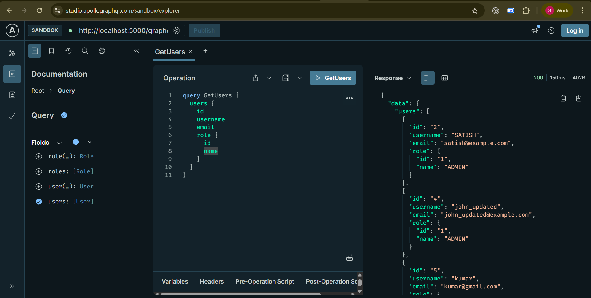

# 🚀 Node.js GraphQL API with PostgreSQL (Apollo + Express)

A professional-level backend project built using **Node.js**, **Apollo Server**, **Express**, and **PostgreSQL**. It provides full **CRUD APIs** for managing **Users** and **Roles** using **GraphQL**.

---

## 📂 Project Structure

```

graphql-user-role-api/
├── src/
│   ├── config/         # PostgreSQL DB config
│   ├── graphql/        # GraphQL schema (typeDefs) and resolvers
│   ├── models/         # User and Role database models
│   └── index.js        # App entry point
├── .env                # Environment variables
├── package.json
├── README.md
└── graphql-queries.md

````

---

## 🛠️ Tech Stack

| Technology           | Description                              |
|----------------------|------------------------------------------|
| Node.js              | JavaScript runtime                       |
| Express.js           | Web framework                            |
| Apollo Server        | GraphQL server for Express               |
| PostgreSQL           | Relational database                      |
| pg                   | PostgreSQL client for Node.js            |
| dotenv               | Environment variable loader              |
| nodemon (dev)        | Auto-restarts the server on file changes |

---

## ⚙️ Environment Setup

Create a `.env` file in the root:

```env
PORT=5000
DB_HOST=localhost
DB_PORT=5432
DB_USER=your_pg_user
DB_PASSWORD=your_pg_password
DB_NAME=user_role_db
````

---

## 🧱 PostgreSQL Schema

Run these queries in **pgAdmin** or any SQL tool:

```sql
CREATE TABLE roles (
  id SERIAL PRIMARY KEY,
  name VARCHAR(100),
  description TEXT
);

CREATE TABLE users (
  id SERIAL PRIMARY KEY,
  username VARCHAR(100) NOT NULL,
  email VARCHAR(100) UNIQUE NOT NULL,
  role_id INTEGER REFERENCES roles(id)
);
```

---

## 🚀 Getting Started

### 1. Install Dependencies

```bash
npm install
```

### 2. Run Development Server

```bash
npm run dev
```

Server will start on: [http://localhost:5000/graphql](http://localhost:5000/graphql)

---

## 🔌 API Endpoints

### GraphQL Playground (Apollo)

📍 **[http://localhost:5000/graphql](http://localhost:5000/graphql)**

Use this to run queries, mutations, and test the schema interactively.

---

## 🧪 Sample GraphQL Operations

See [`graphql-queries-and-mutations.md`](./graphql-queries-and-mutations.md) for all CRUD operations:

* Create / Read / Update / Delete Users
* Create / Read / Update / Delete Roles

---

## 🧠 Key Features

* ✅ Cleanly structured GraphQL schema
* ✅ PostgreSQL integration using `pg` library
* ✅ Modular and scalable project layout
* ✅ Apollo Server with Express middleware
* ✅ Role-based relation between users and roles
* ✅ Easy to extend with authentication, authorization, logging, etc.

---


